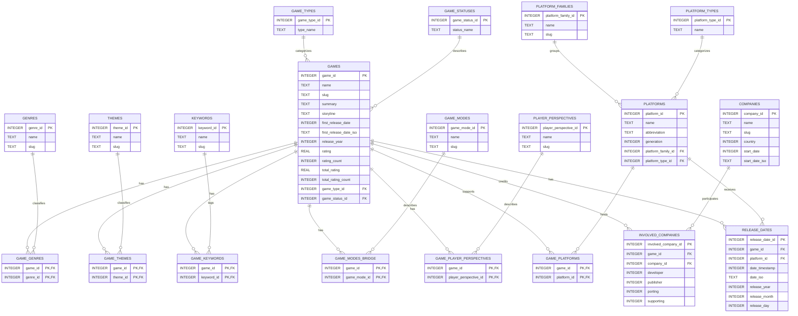
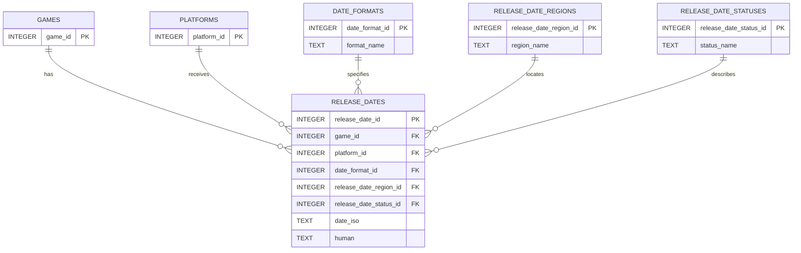

# IGDB Relational Database ERD

This document visualizes the SQLite database created at:

```text
data/database/igdb_games.db
```

The database contains 34 tables. It is split into two diagrams to keep the
relationships readable.

## Core Catalog



## Enrichment And Media

```mermaid
erDiagram
    GAMES {
        INTEGER game_id PK
        TEXT name
    }

    PLATFORMS {
        INTEGER platform_id PK
        TEXT name
    }

    COVERS {
        INTEGER cover_id PK
        INTEGER game_id FK
        TEXT image_id
        TEXT url
        INTEGER width
        INTEGER height
    }

    SCREENSHOTS {
        INTEGER screenshot_id PK
        INTEGER game_id FK
        TEXT image_id
        TEXT url
        INTEGER width
        INTEGER height
    }

    WEBSITES {
        INTEGER website_id PK
        INTEGER game_id FK
        INTEGER website_type_id FK
        INTEGER trusted
        TEXT url
    }

    WEBSITE_TYPES {
        INTEGER website_type_id PK
        TEXT type_name
    }

    EXTERNAL_GAMES {
        INTEGER external_game_id PK
        INTEGER game_id FK
        INTEGER external_game_source_id FK
        INTEGER game_release_format_id FK
        INTEGER platform_id FK
        TEXT uid
        TEXT url
    }

    EXTERNAL_GAME_SOURCES {
        INTEGER external_game_source_id PK
        TEXT source_name
    }

    GAME_RELEASE_FORMATS {
        INTEGER game_release_format_id PK
        TEXT format_name
    }

    MULTIPLAYER_MODES {
        INTEGER multiplayer_mode_id PK
        INTEGER game_id FK
        INTEGER platform_id FK
        INTEGER campaign_coop
        INTEGER offline_coop
        INTEGER online_coop
        INTEGER split_screen
    }

    GAME_TIME_TO_BEATS {
        INTEGER game_time_to_beat_id PK
        INTEGER game_id FK
        INTEGER hastily
        INTEGER normally
        INTEGER completely
        INTEGER count
    }

    POPULARITY_PRIMITIVES {
        INTEGER popularity_primitive_id PK
        INTEGER game_id FK
        INTEGER external_popularity_source_id FK
        INTEGER popularity_type_id FK
        REAL value
        INTEGER calculated_at
    }

    POPULARITY_TYPES {
        INTEGER popularity_type_id PK
        INTEGER external_popularity_source_id FK
        TEXT name
    }

    GAMES ||--o| COVERS : displays
    GAMES ||--o{ SCREENSHOTS : displays

    GAMES ||--o{ WEBSITES : links
    WEBSITE_TYPES ||--o{ WEBSITES : categorizes

    GAMES ||--o{ EXTERNAL_GAMES : maps
    EXTERNAL_GAME_SOURCES ||--o{ EXTERNAL_GAMES : identifies
    GAME_RELEASE_FORMATS ||--o{ EXTERNAL_GAMES : formats
    PLATFORMS ||--o{ EXTERNAL_GAMES : distributes

    GAMES ||--o{ MULTIPLAYER_MODES : supports
    PLATFORMS ||--o{ MULTIPLAYER_MODES : scopes

    GAMES ||--o| GAME_TIME_TO_BEATS : estimates

    GAMES ||--o{ POPULARITY_PRIMITIVES : measures
    POPULARITY_TYPES ||--o{ POPULARITY_PRIMITIVES : defines
    EXTERNAL_GAME_SOURCES ||--o{ POPULARITY_PRIMITIVES : supplies
    EXTERNAL_GAME_SOURCES ||--o{ POPULARITY_TYPES : supplies
```



## Release Date Lookups



## Viewing The Diagrams

In VS Code:

1. Open this file.
2. Press `Ctrl+Shift+V` to open Markdown Preview.
3. If Mermaid is not rendered by your VS Code setup, view the file on GitHub
   or install a Markdown Mermaid preview extension.

The diagrams describe table relationships. The authoritative schema remains
`src/create_IGDB_relational_DB.py` and the generated SQLite database.
