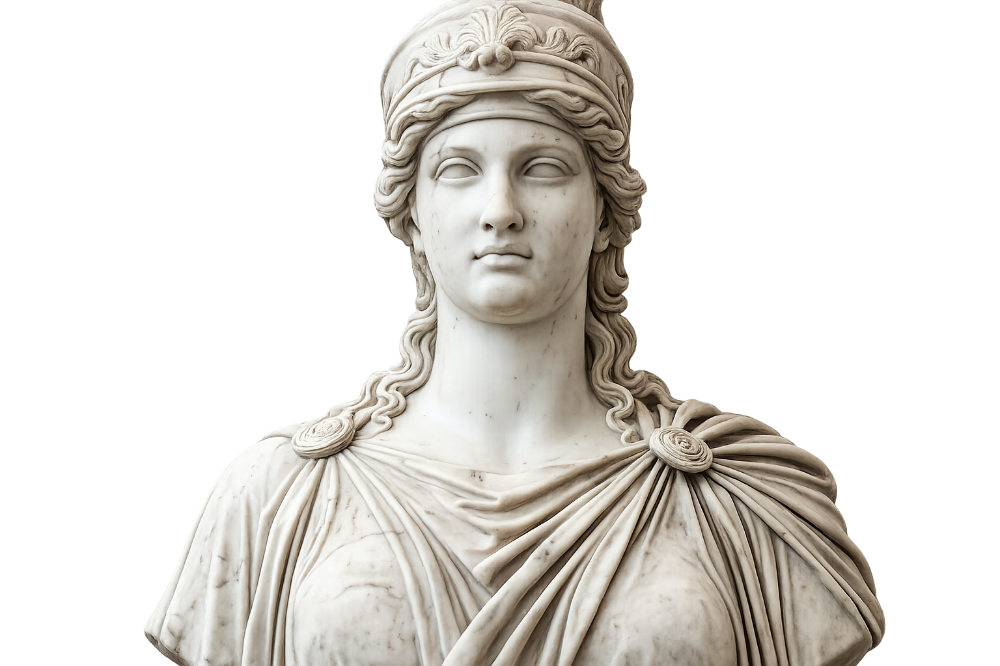

# Ask the Guide Page Plan V6

Use this new image of Athena for the face of our AI, use the entire picture except for the white background. 

Make sure that Athena is centralized. Also i don't like the hexagone around the area. Remove i. The background i want you to make it an intense glitch effect. not the same as the home page. 

Change the wording of the Ask me about this IGDB game-discovery project, the dataset, methodology, hidden gems, recommendations, RAG, or website navigation. I retrieve project context first so the answer stays grounded.

Make sure that it matches the tone of my chatbot's personality

For the chatbox, let's move the texting area under and then the terminal make it on the top. Would it be possible to integrate these two as one? 

Also for the starter prompts, I want the logic to be available when the users does /help 

when the user does this, then we show the example of prompts. So if the user does not do /help it should be only the terminal visible. 

